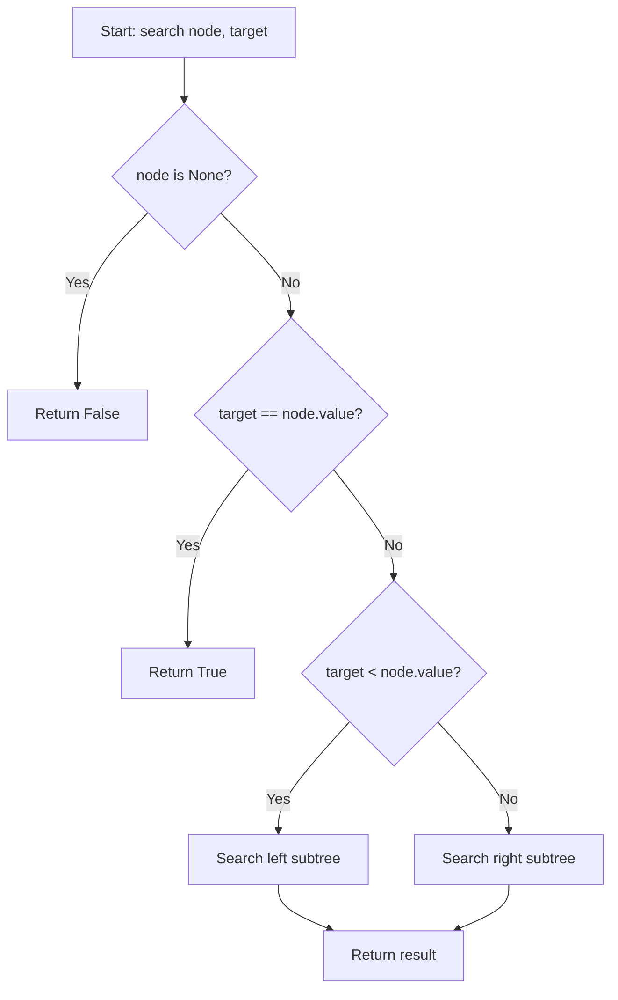
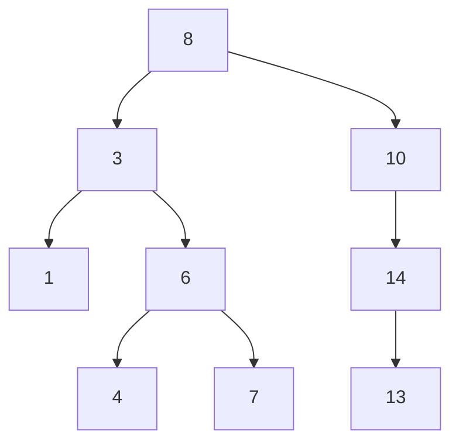
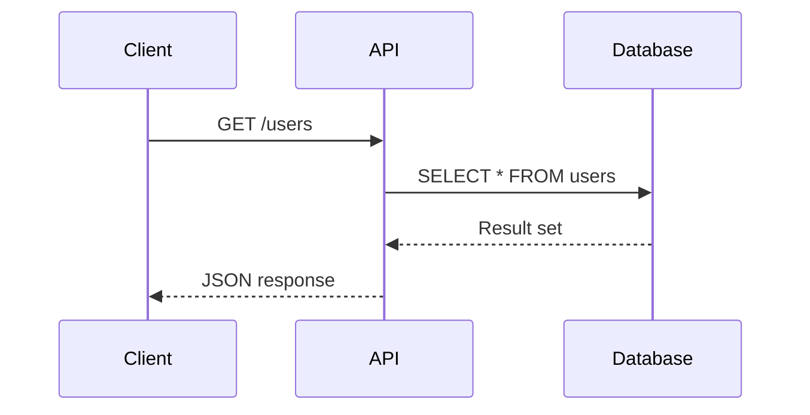

# Creating Presentation Slides

## Learning Outcomes

By the end of this guide, you will be able to:

- Articulate your presentation goals and style to guide AI assistance
- Generate rough draft slides from pedagogical material using AI
- Evaluate and refine AI-generated slide content for your teaching needs
- Use AI for refactoring and iterating on slide structure
- Apply advanced RevealJS features (animations, diagrams, auto-animate)
- Maintain your presentation design skills through intentional practice

## Why RevealJS in Courseasaurus?

RevealJS brings professional presentations into your course site:

**Benefits**:
- **Markdown-based**: Same format as your notes, easy to version control
- **Version-controlled**: Track changes with Git, collaborate with TAs
- **In-browser**: No separate PowerPoint files to manage
- **Shareable**: Students access via URL, works on any device
- **Printable**: Can export as PDFs for accessibility
- **Interactive**: Code demos, animations, fragments, and transitions

**Philosophy**: Slides are tools for your teaching. Your goals, style, and expertise drive the design—not templates or defaults.

## Understanding RevealJS Markdown

### Basic Slide Structure

````markdown
---
title: Binary Search Trees
---

# Binary Search Trees

Lecture 5 - CS 2510

---

## Learning Objectives

- Understand BST properties
- Implement insert and search
- Analyze time complexity

---

## What is a Binary Search Tree?

A binary tree where:
- Left subtree < node value
- Right subtree > node value
- Both subtrees are also BSTs

---

## BST Search Algorithm

```python
def search(node, target):
    if node is None:
        return False
    if target == node.value:
        return True
    elif target < node.value:
        return search(node.left, target)
    else:
        return search(node.right, target)
```

---

## Next Time

Hash tables and collision resolution
````

**Key syntax**:
- `---` separates slides (horizontal)
- `----` creates vertical slides (subsections)
- Standard markdown for content

### Vertical Slides for Subsections

```markdown
---

## BST Operations

----

### Search

Algorithm and examples

----

### Insert

Algorithm and examples

----

### Delete

Algorithm and examples

---

## Practice Problems
```

**Navigation**: Right arrow moves to next main slide, Down arrow explores vertical stack.

## The AI-Assisted Workflow

### Step 1: Define Your Presentation Goals

Before asking AI to generate slides, articulate what you want. Consider:

**Presentation style**:
- Dense slides with talking points, or sparse slides with visuals?
- Lots of small slides or fewer comprehensive ones?
- Heavy use of code examples or more conceptual diagrams?

**Pedagogical approach**:
- Build suspense with fragments, or show everything at once?
- Include questions/exercises on slides, or reserve for discussion?
- Use vertical slides for related subsections, or keep linear?

**Practical constraints**:
- How much time do you have? (This affects slide count)
- What will you draw/demo live? (Don't duplicate in slides)
- What do students need to reference later?

**Example specification**:
> "I teach using a flipped classroom. My slides need to be sparse—mostly diagrams and key definitions—because I do live coding. Students will reference slides later, so they need to be self-contained with complete code examples in speaker notes."

### Step 2: Generate a Rough Draft with AI

Once you know what you want, you can effectively prompt AI to generate a starting point.

**Key principle**: Only ask AI to generate what you can review for accuracy and quality. If your source material is pedagogically sound, AI can restructure it into slides—but you must verify the output.

#### Effective Prompting Template

```
Convert the following lecture notes into RevealJS markdown slides for a [duration] lecture.

Style requirements:
- [Describe your presentation style: sparse/dense, visual/text-heavy, etc.]
- Target approximately [X] slides
- [One main concept per slide / Multiple related points per slide]
- [Include/exclude code examples on slides]

Content requirements:
- Start with [title slide / learning objectives / motivation]
- End with [summary / practice problems / questions]
- [Any special sections: demos, exercises, group work]

Visual elements:
- [Use mermaid diagrams for: flowcharts, trees, graphs]
- [Include HTML tables for: comparison charts, feature matrices]
- [Mark places where I'll draw live with: [BOARD WORK] placeholder]

Animations:
- [Use fragments to build concepts incrementally / Show all content at once]
- [Suggest auto-animate for transitions / Keep transitions simple]

Here are the notes:
[paste your content]
```

#### Example Prompt (Sparse Visual Style)

> "Convert these lecture notes into RevealJS slides for a 50-minute lecture.
>
> Style: Sparse slides with strong visuals. I prefer diagrams over text.
> Target 8-10 main slides. Each slide should have one clear visual focus.
>
> Content: Start with learning objectives. End with practice problems.
> Include placeholders where I'll do live coding demos.
>
> Visuals: Use mermaid diagrams for any tree structures or flowcharts.
> For comparisons, use HTML tables. Mark complex figures with [FIGURE: description].
>
> Animations: Use fragments sparingly—only for step-by-step algorithm walkthroughs.
>
> Notes: [paste lecture notes here]"

#### Example Prompt (Dense Reference Style)

> "Convert these lecture notes into RevealJS slides for a 75-minute lecture.
>
> Style: Comprehensive slides that students will use as reference material later.
> Target 15-20 slides. Include complete code examples and detailed bullet points.
>
> Content: Start with title and learning objectives. Include worked examples.
> End with summary and self-study exercises.
>
> Visuals: Use mermaid sequence diagrams for API call flows. Use HTML tables
> for comparing different approaches. Include all code examples in full.
>
> Animations: Use fragments extensively to build complex examples step by step.
> Suggest where auto-animate would help show code transformations.
>
> Notes: [paste lecture notes here]"

### Step 3: Review and Refine

AI gives you a starting point. Now evaluate:

**Can you verify accuracy?**
- Are technical details correct?
- Are code examples valid?
- Do diagrams accurately represent concepts?

**Does it match your teaching style?**
- Would you actually present this way?
- Is the pacing right for your students?
- Does it support how you want to teach?

**Can you improve it?**
- Are there better examples from your experience?
- Should some slides be merged or split?
- Do animations enhance or distract?

**If the output doesn't work**: Narrow your scope. Instead of "convert all these notes," try "create 3 slides explaining BST insertion with step-by-step animation."

## Iterating and Refactoring with AI

One of AI's strengths is restructuring existing content. Once you have a draft, use AI to refine it.

### Refactoring Slide Structure

**Prompt for reordering**:
> "In these slides, move the 'Tree Traversal' section to appear before 'BST Operations'. Update any references or transitions to maintain flow. Here are the slides: [paste]"

**Prompt for splitting**:
> "This slide has too much content. Split it into 3 slides that progressively build the concept, using fragments to reveal each part. Here's the slide: [paste]"

**Prompt for merging**:
> "These 4 slides all discuss BST properties. Merge them into a single slide with a clear visual hierarchy. Use an HTML table if needed to compare different properties. Here are the slides: [paste]"

**Prompt for restructuring**:
> "Reorganize these 8 slides into a vertical slide stack with 1 main slide and 3 subsections as vertical children. The main slide should be an overview. Here are the slides: [paste]"

### Refining Visual Elements

**Adding diagrams**:
> "Create a mermaid diagram showing the BST insertion algorithm as a flowchart. Include decision points for comparing values. Insert it into slide 4."

**Creating tables**:
> "Create an HTML table comparing BST, AVL, and Red-Black trees across dimensions: balance guarantee, insertion complexity, search complexity. Make it visually clean for presentation."

**Generating code examples**:
> "Write a complete Python implementation of BST insertion with clear comments. Format it for a slide with syntax highlighting. The code should be pedagogically clear, not production-optimized."

### What AI Does Well

✅ **Structural transformations**: Reordering, splitting, merging slides
✅ **Content condensation**: Turning prose into bullets or tables
✅ **Code generation**: Writing clear example code
✅ **Diagram creation**: Mermaid diagrams for standard visualizations
✅ **Format conversion**: Turning data into HTML tables
✅ **Animation suggestions**: Proposing where fragments make sense

### What Requires Your Judgment

⚠️ **Pedagogical flow**: Does the order make sense for learning?
⚠️ **Visual design**: Does it look good on screen?
⚠️ **Code correctness**: Does the code actually work?
⚠️ **Timing**: Will this fit your lecture time?
⚠️ **Student needs**: What will confuse vs. clarify?
⚠️ **Teaching moments**: Where do you need flexibility?

**Core principle**: AI is a tool for restructuring and drafting. You make the pedagogical decisions.

## Advanced RevealJS Features

### Fragment Animations (Progressive Reveal)

Reveal content progressively to build understanding:

```markdown
---

## BST Properties

- Left subtree contains smaller values <!-- .element: class="fragment" -->
- Right subtree contains larger values <!-- .element: class="fragment" -->
- Both subtrees are BSTs <!-- .element: class="fragment" -->

---
```

**When to use**: Building complex concepts step by step, revealing answers after posing questions.

**AI prompt**:
> "Add fragment animations to this slide to reveal the properties one at a time, building suspense. Then create a second slide that shows an example tree and reveals which property each subtree satisfies."

### Auto-Animate (Magic Move)

Create Keynote-style "magic move" transitions where elements smoothly morph between slides:

````markdown
---

## Code Evolution

```python
def search(node, target):
    if node is None:
        return False
    return True  # simplified
```

---

## Code Evolution

```python [2-3]
def search(node, target):
    if node is None:
        return False
    if target == node.value:
        return True
    return False  # still incomplete
```

---

## Final Code

```python
def search(node, target):
    if node is None:
        return False
    if target == node.value:
        return True
    elif target < node.value:
        return search(node.left, target)
    else:
        return search(node.right, target)
```

<!-- Auto-animate will smoothly transition between these code blocks -->
---
````

**AI prompt for auto-animate**:
> "Create a sequence of 4 slides that use auto-animate to show how the BST insertion algorithm is built incrementally. Start with just the base case, then add the comparison logic, then add the recursive calls, then add the return statement. Use data-auto-animate attributes."

### Slide Transitions

```markdown
---
<!-- .slide: data-transition="slide" -->

## Standard Transition

---
<!-- .slide: data-transition="fade" -->

## Fading to New Content
---
```

**Types**: slide, zoom, fade, convex, concave, none

**Philosophy**: Don't let transitions distract from content. Use fade or slide for most presentations.

### Background Colors for Sections

```markdown
---
<!-- .slide: data-background="#2a5f7a" -->

## Section 2: BST Operations

---

## Search Operation

[back to normal background]
---
```

**Use for**: Signaling major section breaks, creating visual rhythm.

## Creating Visual Elements with AI

### Mermaid Diagrams

AI can generate mermaid diagrams directly in your slides. These render as clean SVG graphics.

**Flowcharts**:

**Prompt**:
> "Create a mermaid flowchart showing the BST search algorithm. Include decision diamonds for comparisons, rectangular boxes for actions, and arrows showing flow. Label each step clearly."

**Output** (example):
````markdown
---

## BST Search Algorithm



---
````

**Tree structures**:

**Prompt**:
> "Create a mermaid diagram showing a binary search tree with root 8, containing values 3, 10, 1, 6, 14, 4, 7, 13."

````markdown
---

## Example BST



---
````

**Sequence diagrams** (for API calls, system interactions):

**Prompt**:
> "Create a mermaid sequence diagram showing how a client calls a REST API, the API queries a database, and returns results."

````markdown
---

## API Call Flow



---
````

**When AI-generated diagrams work well**:
- Standard structures (trees, graphs, flowcharts)
- Algorithm visualizations
- System architecture diagrams
- Process flows

**When to create manually**:
- Complex custom visualizations
- Diagrams requiring specific aesthetic
- Annotations and callouts
- Domain-specific notations

### HTML Tables for Comparisons

For comparing options, features, or tradeoffs, HTML tables are more flexible than markdown:

**Prompt**:
> "Create an HTML table comparing BST, AVL Tree, and Red-Black Tree. Include rows for: balance guarantee, worst-case search time, insertion time, deletion time, and use cases. Make it styled for a presentation slide—clean and readable."

**Output** (example):
```markdown
---

## Tree Structure Comparison

<table>
  <thead>
    <tr>
      <th>Data Structure</th>
      <th>Balance</th>
      <th>Search</th>
      <th>Insert</th>
      <th>Delete</th>
    </tr>
  </thead>
  <tbody>
    <tr>
      <td><strong>BST</strong></td>
      <td>None</td>
      <td>O(n)</td>
      <td>O(n)</td>
      <td>O(n)</td>
    </tr>
    <tr>
      <td><strong>AVL Tree</strong></td>
      <td>Strict</td>
      <td>O(log n)</td>
      <td>O(log n)</td>
      <td>O(log n)</td>
    </tr>
    <tr>
      <td><strong>Red-Black Tree</strong></td>
      <td>Relaxed</td>
      <td>O(log n)</td>
      <td>O(log n)</td>
      <td>O(log n)</td>
    </tr>
  </tbody>
</table>

---
```

**Reveal table rows incrementally** with fragments:
```html
<tr class="fragment">
  <td><strong>BST</strong></td>
  <td>None</td>
  <td>O(n)</td>
  <td>O(n)</td>
  <td>O(n)</td>
</tr>
```

### Placeholders for Complex Figures

Not everything should be generated by AI. For complex figures:

**Prompt**:
> "Where I've written [BOARD WORK], replace it with a clear placeholder indicating I'll draw a tree rotation diagram live. Include a note about what to draw."

**Output**:
```markdown
---

## Tree Rotation Example

**[LIVE DEMO: Draw tree rotation on board]**

Starting tree: Right-heavy, needs left rotation
Show: Pivot selection, child reassignment, final balanced tree

Note: Use values 10, 20, 30 for clarity. 
Emphasize that rotation preserves BST property.

---
```

**When to use placeholders**:
- Animations or interactive demos
- Complex diagrams requiring precise layout
- Content you'll draw/build live
- External tools (code editors, browsers)

## Speaker Notes

### Why Speaker Notes Matter

- **Consistency**: Teach the same key points each time
- **Coverage**: Remember to mention important details
- **Timing**: Know how long each slide takes
- **Examples**: Remember which examples you planned

### Format

```markdown
---

## Binary Search Tree

A binary tree with ordering property:
- Left < Node < Right

Note:
Remember to draw example on board showing values 5, 3, 7, 2, 4, 6, 8.
Emphasize that EVERY subtree must satisfy the property.
Common student misconception: thinking only immediate children need to be ordered.
Ask: "Is 7 greater than 2?" to test their understanding.
Time: 3 minutes including drawing.
---
```

**Note section**: Everything after `Note:` is your speaker notes.

### Using AI to Draft Speaker Notes

AI can create a starting point for speaker notes, but these require significant personalization.

**Initial draft prompt**:
> "For each of these slides, generate speaker notes that:
> - Explain what to emphasize verbally
> - Suggest concrete examples to give
> - Note common student misconceptions for this topic
> - Estimate timing (be realistic for college lecture pace)
> - Suggest questions to pose to students
>
> [paste slides]"

**What you must personalize**:
- **Your examples**: Replace generic examples with ones from your experience
- **Your anecdotes**: Add stories that illustrate concepts
- **Your timing**: Adjust based on how you actually teach
- **Your students**: Incorporate misconceptions you've actually encountered
- **Your teaching moments**: Note where you need flexibility

**Example transformation**:

**AI-generated note**:
> Note: Explain that BST property must hold for every subtree. Give an example tree. Mention common misconception that only immediate children need ordering. Time: 2-3 minutes.

**Personalized note**:
> Note: Draw tree with 8, 3, 10, 1, 6, 14, 4, 7, 13 on board. Ask "Is this a valid BST?" Before revealing answer, ask "What do we need to check?" Wait for responses. Common student error: they check only parent-child pairs, miss that left subtree root (3) must be < all right subtree values. Reference hw2 problem 3 where many made this mistake. If time, show the invalid tree from that problem. Time: 4-5 minutes (longer if good discussion).

## Code in Slides

### Syntax Highlighting

````markdown
---

## BST Search Code

```python
def search(node, target):
    if node is None:
        return False
    if target == node.value:
        return True
    elif target < node.value:
        return search(node.left, target)
    else:
        return search(node.right, target)
```

---
````

**Language tags**: python, java, javascript, typescript, etc.

### Highlighting Lines

````markdown
---

## Focus on Base Case

```python
def search(node, target):
    if node is None:        # Highlight this
        return False        # and this
    if target == node.value:
        return True
    ...
```
{: data-line-numbers="2-3"}

---
````

### Code Fragments

Reveal code incrementally:

````markdown
---

## Building BST Insert

```python
def insert(node, value):
    if node is None:        
        return Node(value)  
```
<!-- .element: class="fragment" -->

```python
    if value < node.value:
        node.left = insert(node.left, value)
    else:
        node.right = insert(node.right, value)
```
<!-- .element: class="fragment" -->

```python
    return node
```
<!-- .element: class="fragment" -->

---
````

## Articulating Your Visual Style

Before asking AI to generate or refine slides, clarify your own design preferences.

### Consider Your Teaching Context

**Presentation vs. Reference**:
- Will students see these only during lecture, or study from them later?
- Does this change how much detail you include?

**Live elements**:
- What will you draw/code/demo live?
- What needs to be on slides to set up those moments?

**Student needs**:
- Do your students benefit from dense reference slides?
- Or do sparse slides keep them focused on your teaching?

**Your comfort**:
- Do you like speaking from detailed notes on slides?
- Or prefer minimal slides with flexibility?

### Slide Density Spectrum

Different instructors have different preferences. Both approaches can work:

**Sparse style** (fewer slides, less text):
```markdown
## BST Search

Left < Node < Right

[Most explanation is verbal, with board work]
```

**Dense style** (reference material):
```markdown
## BST Search Algorithm

**Idea**: Compare target with current node value

- If target < node.value → search left subtree
- If target > node.value → search right subtree  
- If target == node.value → found!

**Complexity**: O(h) where h is tree height
- Balanced tree: O(log n)
- Degenerate tree: O(n)

[Complete information for later reference]
```

**Communicate your preference to AI**:
> "I prefer sparse slides with strong visual focus. Text should be minimal—just key terms and definitions. I explain details verbally and use the board."

Or:

> "I want comprehensive reference slides. Students should be able to review slides later and see complete information including examples and complexity analysis."

### Visual Hierarchy

Think about how you want to structure information:

**Option 1: Build incrementally**
- Multiple slides showing progression
- Fragments revealing steps
- Auto-animate for transformations

**Option 2: Show complete picture**
- Single comprehensive slide
- All information visible
- Student can see full context

**Tell AI what you want**:
> "For the sorting algorithm section, create a sequence of slides that build the algorithm incrementally. Start with just the idea, then pseudocode, then complete implementation, then analysis. Use auto-animate between slides."

### Balancing Text and Visuals

**Text-heavy approach**:
- Good for: definitions, algorithms, reference material
- Challenge: Can become boring, students tune out

**Visual-heavy approach**:
- Good for: engagement, intuition, memorable concepts
- Challenge: May not provide enough reference material

**Mixed approach**:
- Alternate text slides and visual slides
- Use diagrams to reinforce textual concepts
- Include both overview slides and detail slides

**Ask AI for what you need**:
> "For this concept, create two versions: one visual slide with a mermaid diagram and minimal text, and one detailed slide with complete explanation. I'll decide which fits better."

## Skill Maintenance and Deliberate Practice

### The Risk of Over-Automation

If you always use AI to generate slides, you may lose the ability to:
- Identify the core concept of a topic
- Structure information hierarchically
- Choose effective visual representations
- Estimate timing and pacing

**These are valuable pedagogical skills.** Don't let them atrophy.

### Maintaining Your Presentation Skills

**Deliberately practice without AI**:
- Once per semester, create a lecture's slides entirely manually
- For new topics, sketch slide structure on paper before using AI
- Regularly critique slides: "Would I have structured this differently?"
- Experiment with different presentation styles

**Reflect on what you're delegating**:
- Can you still create a presentation from scratch if needed?
- Do you understand why certain slide structures work better?
- Are you developing your own presentation philosophy, or adopting AI's defaults?

### What AI Should Not Replace

**Your pedagogical judgment**:
- Which concepts need more time?
- What order builds understanding best?
- When to use questions vs. explanations?

**Your teaching presence**:
- Your examples and stories
- Your response to student confusion
- Your ability to adapt mid-lecture
- Your enthusiasm for the material

**Your expertise**:
- Verifying technical accuracy
- Choosing appropriate difficulty level
- Anticipating student misconceptions
- Connecting concepts across lectures

### Effective AI Boundaries

**Use AI generously for**:
- Initial drafts of slide structure
- Formatting code examples
- Generating mermaid diagrams
- Creating HTML tables
- Suggesting animation approaches
- Refactoring and restructuring

**Use AI cautiously for**:
- Speaker notes (require heavy personalization)
- Example selection (you know better examples)
- Timing estimates (adjust to your pace)
- Pedagogical ordering (requires expertise)

**Don't use AI for**:
- Final pedagogical decisions
- Evaluating slide effectiveness
- Adapting during teaching
- Understanding your students' needs
- Deciding what to teach and why

### The Iteration Principle

Remember: AI gives you rough drafts, not finished products.

**Good workflow**:
1. Articulate what you want clearly
2. Generate rough draft with AI
3. Review critically with your expertise
4. Refine iteratively
5. Personalize with your examples
6. Test in teaching context
7. Improve based on student response

**Poor workflow**:
1. Tell AI to "create slides on topic X"
2. Briefly skim output
3. Use in lecture
4. Wonder why teaching felt off

### Teaching vs. Presenting

**Slides support teaching; they aren't teaching.**

The best teaching moments often happen:
- When you deviate from slides to address confusion
- During board work and live coding
- In response to student questions
- Through discussions and activities
- When you notice and adapt to student reactions

If you're so reliant on AI-generated slides that you can't adapt, you've delegated too much.


## Meta-Example: Generating slides to explain how to create a group project with AI

We asked Claue Sonnet 4.5 to generate slides to explain how to create a group project with AI. As this is for purely demonstrational purposes, we did not edit the slides, only reviewing them for basic accuracy.